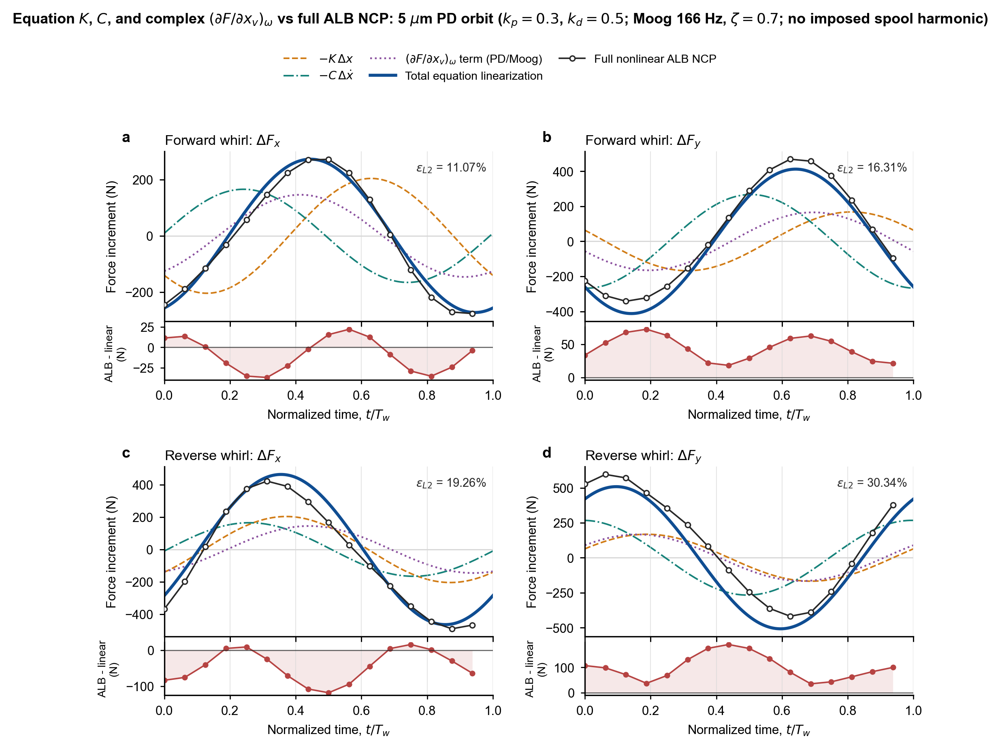

# ALB 压力-温度-节流器谐波线性化推导与数值计算

## 文档角色

- 角色：稳定公式、离散线性化和数值计算参考。
- 目的：给出 ALB 压力、温度、节流器耦合控制方程的解析谐波线性化，以及 `K(γ)`、`C(γ)` 和复数 `G_{x_v}(γ)` 的数值计算过程。
- 允许更新：控制方程、解析一阶展开、固定活动集规则、频域矩阵、量纲换算、稳定数值结果和实现映射。
- 禁止更新：实时任务状态、训练进度、PID、ETA、临时日志堆叠和移动空化边界描述函数。
- 更新节奏：控制方程、线性化定义、涡动频率比定义、数值工作点或正式系数变化时更新。
- 事实来源 / 相关文档：`docs/formula/thermal_model.md`、`docs/formula/symbol_conventions.md`、`ALB/physics/thermal/solver.py`、`ALB/physics/thermal/scales.py`、`ALB/physics/hydraulics/orifice.py` 和当前方程级解析验证结果。

## 1. 范围与最终口径

本文采用以下正式口径：

1. `K`、`C` 和阀芯力传递由控制方程的解析 Jacobian 与热容量矩阵直接得到，不使用载荷差分、输入差分、残差差分、代理模型偏导或轨迹拟合生成系数。
2. Reynolds 空化互补问题只在基态求解中保留。基态收敛后，仅检查双活动节点数是否为零；检查通过后固定基态活动集。
3. 正式线性化不求解移动空化边界，不使用逐相位 MLCP，也不计算有限幅值空化描述函数。
4. 热惯性通过温度容量矩阵进入频域系统，因此 `K(γ)`、`C(γ)` 和 `G_{x_v}(γ)` 随涡动频率比变化，其中阀芯传递一般是复矩阵。
5. 本文使用正确的涡动频率比定义

$$
\boxed{
\gamma=\frac{\Omega_w}{\Omega_r}
=\frac{f_w}{f_r}},
\qquad
\Omega_w=\gamma\Omega_r.
$$

其中 `w` 表示涡动，`r` 表示轴旋转。若沿用论文原符号，以 `Ω` 表示涡动角速度、`ω` 表示轴转角速度，则正确关系是 `γ=Ω/ω`，不是其倒数。

最终复幅值关系定义为

$$
\boxed{
\hat F
=-\left[K(\gamma)+i\gamma\Omega_rC(\gamma)\right]\hat x
+G_{x_v}(\gamma)\hat x_v.}
$$

## 2. 符号、输入和坐标约定

### 2.1 频率和无量纲输入

轴转速为 `n`，则

$$
f_r=\frac{n}{60},
\qquad
\Omega_r=2\pi f_r.
$$

若已知涡动频率 `f_w`，则

$$
\gamma=\frac{f_w}{n/60}=\frac{60f_w}{n}.
$$

不能直接计算 `f_w/n`，因为 `Hz` 和 `r/min` 的单位不同。本文把 `γ` 作为正的频率幅值比；正、反涡动方向由轨迹方向单独描述。

无量纲输入为

$$
u=[e_x,e_y,v_x,v_y,s_x,s_y]^T,
$$

$$
e=\frac{x}{c},
\qquad
v=\frac{\dot x}{c\Omega_r},
$$

其中 `s_x,s_y` 是 ALB 接口中的归一化阀芯位移。每个瓦块的耦合状态写为

$$
z=[p,T,y]^T,
\qquad
y=[q_s,p_{sv},q_1,q_2,q_3]^T.
$$

### 2.2 膜厚、挤压速度和力符号

当前 ALB 坐标约定为

$$
h=1+e_x\sin\theta-e_y\cos\theta+h_{\mathrm{tank}},
$$

$$
h_\tau=v_x\sin\theta-v_y\cos\theta.
$$

力的符号约定为

$$
\boxed{
\delta F=-K\,\delta x-C\,\delta\dot x
+\delta F_{x_v}.}
$$

其中复系数 `G_{x_v}` 对应的实值时域力 `δF_{x_v}` 按第 6.3 节由谐波复幅值重建，不能把复矩阵直接乘以瞬时实数阀芯位移。

如果论文使用另一套膜厚三角函数或坐标方向，必须先完成坐标映射，不能直接比较矩阵分量及交叉项符号。

## 3. 非线性基态控制方程

### 3.1 Reynolds 方程和温黏关系

定义无量纲黏度与流动系数

$$
\mu=\exp[-\beta_*(T-T_{\mathrm{ref}})],
\qquad
a=\frac{h^3}{\mu}.
$$

Reynolds 强残差采用

$$
\begin{aligned}
R_p={}&
\ell_r^2\partial_\theta(ap_{,\theta})
+\partial_\zeta(ap_{,\zeta})
+\sum_jq_j\delta_j\\
&-\lambda_0h_{,\theta}
-2\lambda_0v_fh_\tau.
\end{aligned}
$$

基态压力满足互补条件

$$
\boxed{
p_0\ge0,
\qquad
R_{p0}\ge0,
\qquad
p_0\perp R_{p0}.}
$$

因此内部节点分为：

- 有压节点：`p_0>0`、`R_{p0}=0`；
- 空化节点：`p_0=0`、`R_{p0}>0`；
- 双活动节点：`p_0=0`、`R_{p0}=0`。

本文所称“严格基态”不是新的物理模型，其数值作用仅是：确认基态互补残差已收敛，并确认双活动节点数为零。满足该条件后，局部 Jacobian 唯一，随后固定基态活动集。

### 3.2 瞬态温度方程

周向、轴向平均流量为

$$
q_\theta=\lambda_0h-\ell_r^2ap_{,\theta},
\qquad
q_\zeta=-ap_{,\zeta}.
$$

定义

$$
S=\frac{\lambda_0^2}{3\ell_r^2},
\qquad
G=\ell_r^2p_{,\theta}^2+p_{,\zeta}^2,
$$

则耗散热源为

$$
\Phi=\Theta_E\left(S\frac{\mu}{h}+aG\right).
$$

开启热惯性后的半离散温度方程写为

$$
\boxed{
M_T(h)\dot T+R_T(p,T,y,u)=0.}
$$

Galerkin-SUPG 残差包含导热、对流、耗散热和供油冷源：

$$
\begin{aligned}
R_T(w)={}&\int_\Omega[
D_\theta T_{,\theta}w_{,\theta}
+D_\zeta T_{,\zeta}w_{,\zeta}
+q_\theta T_{,\theta}w
+q_\zeta T_{,\zeta}w
-\Phi w]d\Omega\\
&+\sum_{q_j>0}q_j(T_j-T_s)w_j
+R_{\mathrm{SUPG}}(w).
\end{aligned}
$$

热容量矩阵为

$$
(M_T)_{ij}=\int_\Omega
N_i\frac{hcr}{q_f}N_j\,d\Omega.
$$

### 3.3 毛细管-缝隙节流器

每个瓦块采用当前 `CSOrifice` 残差：

$$
r_0=q_s-\sum_{j=1}^{3}q_j=0,
$$

$$
r_1=q_s-\sigma\left[
q_{\mathrm{leak}}
+c_{q0}|x_v|\sqrt{|p_s-p_{sv}|}
\right]=0,
$$

$$
r_j=\frac{c_{q1}}{h_j^2}q_j|q_j|
+c_{q2}q_j-(p_{sv}-p_j)=0.
$$

这里

$$
\sigma=\operatorname{sign}(p_s-p_{sv}).
$$

该方程不能替换为一般四边滑阀方程，否则阀芯力传递不再对应当前 ALB 模型。

## 4. 谐波扰动的逐项解析线性化

### 4.1 复幅值展开和速度关系

对任意变量采用

$$
g(t)=g_0+\operatorname{Re}
\left\{\hat g e^{i\Omega_wt}\right\}
=g_0+\operatorname{Re}
\left\{\hat g e^{i\gamma\Omega_rt}\right\}.
$$

因此

$$
\hat{\dot x}=i\Omega_w\hat x,
$$

$$
\boxed{
\hat v
=\frac{\hat{\dot x}}{c\Omega_r}
=i\frac{\Omega_w}{\Omega_r}\hat e
=i\gamma\hat e.}
$$

将所有控制方程代入上述展开，只保留扰动幅值的一阶项。这个过程是解析摄动展开，不是通过 `x_0±Δx` 重新计算载荷的数值差分。

### 4.2 膜厚、黏度和流动系数

膜厚与挤压速度的一阶变化为

$$
\hat h=\hat e_x\sin\theta-\hat e_y\cos\theta,
$$

$$
\hat h_\tau=\hat v_x\sin\theta-\hat v_y\cos\theta.
$$

在黏度未触及截断的光滑支路上

$$
\hat\mu=-\beta_*\mu_0\hat T.
$$

因为 `a=h^3/μ`，所以

$$
\begin{aligned}
\hat a
&=\frac{3h_0^2}{\mu_0}\hat h
-\frac{h_0^3}{\mu_0^2}\hat\mu\\
&=a_0\left(3\frac{\hat h}{h_0}
+\beta_*\hat T\right).
\end{aligned}
$$

即

$$
\boxed{
\hat a=a_0\left(3\frac{\hat h}{h_0}
+\beta_*\hat T\right).}
$$

### 4.3 Reynolds 残差

扩散通量的一阶变化分别为

$$
\delta(ap_{,\theta})
=a_0\hat p_{,\theta}+\hat a p_{0,\theta},
$$

$$
\delta(ap_{,\zeta})
=a_0\hat p_{,\zeta}+\hat a p_{0,\zeta}.
$$

逐项代入得到

$$
\begin{aligned}
\hat R_p={}&
\ell_r^2\partial_\theta
(a_0\hat p_{,\theta}+\hat a p_{0,\theta})\\
&+\partial_\zeta
(a_0\hat p_{,\zeta}+\hat a p_{0,\zeta})
+\sum_j\hat q_j\delta_j\\
&-\lambda_0\hat h_{,\theta}
-2\lambda_0v_f\hat h_\tau.
\end{aligned}
$$

离散后形成

$$
J_{pp}\hat p+J_{pT}\hat T+J_{py}\hat y
+R_{p,h}\hat h+R_{p,h_\tau}\hat h_\tau=0.
$$

### 4.4 固定基态活动集

严格基态检查通过后，压力行只采用以下固定规则：

$$
\begin{cases}
\hat R_{p,i}=0,
&i\in\mathcal A_0,
\quad p_{i0}>0,\\[1mm]
\hat p_i=0,
&i\in\mathcal I_0,
\quad R_{p,i0}>0.
\end{cases}
$$

几何边界节点同样使用零压力行。线性化过程中不重新分类节点，不计算活动集移动。

如果存在 `p_{i0}=R_{p,i0}=0` 的双活动节点，上述两种行均可能成立，普通 Jacobian 将不唯一。因此，严格基态在本计算中的核心作用就是确认双活动节点数为零，而不是引入额外的空化扰动模型。

### 4.5 温度残差

流量的一阶变化为

$$
\hat q_\theta
=\lambda_0\hat h
-\ell_r^2
(\hat a p_{0,\theta}+a_0\hat p_{,\theta}),
$$

$$
\hat q_\zeta
=-(\hat a p_{0,\zeta}+a_0\hat p_{,\zeta}).
$$

压力梯度平方项满足

$$
\hat G=2\left(
\ell_r^2p_{0,\theta}\hat p_{,\theta}
+p_{0,\zeta}\hat p_{,\zeta}
\right).
$$

耗散热源的一阶变化为

$$
\boxed{
\hat\Phi=\Theta_E\left[
S\left(\frac{\hat\mu}{h_0}
-\frac{\mu_0\hat h}{h_0^2}\right)
+\hat aG_0+a_0\hat G
\right].}
$$

Galerkin 部分的一阶残差为

$$
\begin{aligned}
\hat R_{T,G}(w)={}&\int_\Omega[
D_{\theta0}\hat T_{,\theta}w_{,\theta}
+D_{\zeta0}\hat T_{,\zeta}w_{,\zeta}\\
&+\hat D_\theta T_{0,\theta}w_{,\theta}
+\hat D_\zeta T_{0,\zeta}w_{,\zeta}]d\Omega\\
&+\int_\Omega[
q_0\cdot\nabla\hat T
+\hat q\cdot\nabla T_0
-\hat\Phi]w\,d\Omega\\
&+\sum_{q_{j0}>0}
[q_{j0}\hat T_j
+\hat q_j(T_{j0}-T_s)]w_j.
\end{aligned}
$$

冻结工作点 SUPG 参数 `τ_0` 后，一阶 SUPG 项为

$$
\begin{aligned}
\hat R_{\mathrm{SUPG}}(w)
=\int_\Omega\tau_0\{&
(\hat q\cdot\nabla w)
(q_0\cdot\nabla T_0-\Phi_0)\\
&+(q_0\cdot\nabla w)
[\hat q\cdot\nabla T_0
+q_0\cdot\nabla\hat T
-\hat\Phi]\}\,d\Omega.
\end{aligned}
$$

因此温度 Jacobian 必须同时包含压力扰动、温度扰动、膜厚扰动、流量扰动和节流器冷源扰动，不能只保留 `q_0·∇T̂`。

### 4.6 热惯性项

基态为稳态，因此

$$
\dot T_0=0.
$$

容量项的一阶变化为

$$
\begin{aligned}
\delta[M_T(h)\dot T]
&=M_T(h_0)\delta\dot T
+\delta M_T\dot T_0\\
&=M_{T0}\delta\dot T.
\end{aligned}
$$

进入谐波域后

$$
\boxed{
\delta[M_T\dot T]
=i\Omega_wM_{T0}\hat T
=i\gamma\Omega_rM_{T0}\hat T.}
$$

由于 `Ṫ_0=0`，容量矩阵对膜厚的扰动不进入一阶项；膜厚对 Reynolds、热通量、耗散热和节流器阻力的导数仍需保留。

### 4.7 节流器残差

在工作点冻结 `σ=sign(p_s-p_{sv})`、`sign(x_v)` 和 `sign(q_j)`。三组残差的一阶变化为

$$
\hat r_0=\hat q_s-\sum_j\hat q_j,
$$

$$
\hat r_1=\hat q_s
+\frac{c_{q0}|x_v|}
{2\sqrt{|p_s-p_{sv}|}}\hat p_{sv}
-\sigma c_{q0}\operatorname{sign}(x_v)
\sqrt{|p_s-p_{sv}|}\hat x_v,
$$

$$
\begin{aligned}
\hat r_j={}&
\left(\frac{2c_{q1}|q_j|}{h_j^2}+c_{q2}\right)\hat q_j
-\hat p_{sv}+\hat p_j\\
&-\frac{2c_{q1}q_j|q_j|}{h_j^3}\hat h_j.
\end{aligned}
$$

这些式子直接产生 `J_{yp}`、`J_{yy}`、膜厚输入列和阀芯输入列，不需要对节流器输入执行正负差分。

## 5. 全耦合频域矩阵

### 5.1 分块系统

固定基态活动集后，每个瓦块的频域系统为

$$
\boxed{
\begin{bmatrix}
J_{pp}&J_{pT}&J_{py}\\
J_{Tp}&J_{TT}+i\gamma\Omega_rM_T&J_{Ty}\\
J_{yp}&0&J_{yy}
\end{bmatrix}_0
\begin{bmatrix}
\hat p\\
\hat T\\
\hat y
\end{bmatrix}
=-
\begin{bmatrix}
R_{p,u}\\
R_{T,u}\\
R_{y,u}
\end{bmatrix}_0\hat u.}
$$

定义

$$
J_0=
\begin{bmatrix}
J_{pp}&J_{pT}&J_{py}\\
J_{Tp}&J_{TT}&J_{Ty}\\
J_{yp}&0&J_{yy}
\end{bmatrix}_0,
$$

$$
M_0=\operatorname{blockdiag}(0,M_T,0),
$$

$$
\boxed{
A_\gamma=J_0+i\gamma\Omega_rM_0.}
$$

对六个独立输入列分别求解

$$
\boxed{
\hat z_{,u_k}(\gamma)
=-A_\gamma^{-1}R_{,u_k},
\qquad
u_k\in\{e_x,e_y,v_x,v_y,s_x,s_y\}.}
$$

同一 `γ` 下矩阵 `A_γ` 相同，因此每个瓦块只需分解一次，再对六个右端进行回代。

### 5.2 载荷传递矩阵

压力载荷为线性积分

$$
\bar F=Wp=L_Fz,
\qquad
L_F=[W,0,0].
$$

定义六列无量纲力传递

$$
H_k(\gamma)=L_F\hat z_{,u_k}(\gamma),
$$

并按输入分为

$$
H(\gamma)=[H_e(\gamma),H_v(\gamma),H_s(\gamma)].
$$

四个瓦块的传递矩阵直接求和。这里求解的是解析线性系统，不对非线性载荷做相减。

## 6. `K(γ)`、`C(γ)` 和复阀芯系数

### 6.1 位移组合阻抗

由于

$$
\hat v=i\gamma\hat e,
$$

位移输入和速度输入必须合并为

$$
H_x(\gamma)=H_e(\gamma)+i\gamma H_v(\gamma).
$$

有量纲组合阻抗为

$$
\boxed{
Z_x(\gamma)
=-\frac{F_*}{c}
\left[H_e(\gamma)+i\gamma H_v(\gamma)\right].}
$$

因此

$$
\boxed{
K(\gamma)=\operatorname{Re}Z_x(\gamma),}
$$

$$
\boxed{
C(\gamma)=
\frac{\operatorname{Im}Z_x(\gamma)}
{\gamma\Omega_r}.}
$$

`C` 的除数是实际涡动角频率 `Ω_w=γΩ_r`，不是固定的轴转角频率。

### 6.2 复阀芯力传递

阀芯传递为

$$
\boxed{
G_{x_v}(\gamma)
=F_*H_s(\gamma)
=-F_*L_FA_\gamma^{-1}R_{,x_v}.}
$$

热惯性开启时，`A_γ` 是复矩阵，因此

$$
\boxed{
G_{x_v}(\gamma)
=G_{x_v}^{R}(\gamma)
+iG_{x_v}^{I}(\gamma).}
$$

实部表示同相力分量，虚部表示温度动态引起的正交相位分量。当前 `x_v` 是归一化阀芯位移，所以单位为 `N/归一化阀芯量`；若改用物理阀芯行程，需要再除以阀芯参考行程。

### 6.3 复阀芯系数的实值时域重建

令单频阀芯扰动为

$$
\delta x_v(t)
=\operatorname{Re}\left\{
\hat x_v e^{i\Omega_w t}
\right\}.
$$

复阀芯系数产生的实值力必须按

$$
\boxed{
\delta F_{x_v}(t)
=\operatorname{Re}\left\{
G_{x_v}(\gamma)\hat x_v e^{i\Omega_w t}
\right\}.}
$$

将 `G_{x_v}=G_{x_v}^{R}+iG_{x_v}^{I}` 展开，并利用

$$
\delta\dot x_v(t)
=\operatorname{Re}\left\{
i\Omega_w\hat x_v e^{i\Omega_w t}
\right\},
$$

可得完全等价的实值形式

$$
\boxed{
\delta F_{x_v}(t)
=G_{x_v}^{R}\delta x_v(t)
+\frac{G_{x_v}^{I}}{\Omega_w}\delta\dot x_v(t).}
$$

因此，当前单频线性时域力为

$$
\boxed{
\delta F_{\mathrm{linear}}(t)
=-K\delta x(t)-C\delta\dot x(t)
+G_{x_v}^{R}\delta x_v(t)
+\frac{G_{x_v}^{I}}{\Omega_w}\delta\dot x_v(t).}
$$

如果验证轨迹固定阀芯，即 `δx_v=δ\dot x_v=0`，第三项严格为零；这类轨迹只能验证 `K/C`，不能验证 `G_{x_v}`。上述实值重建只对应计算 `G_{x_v}` 时的同一个单频 `Ω_w`。对任意宽频阀芯输入，不能把该单频复矩阵当作全频常数，而应保留温度状态或使用频率相关传递模型。

闭环验证不需要、也不应人为指定 `δx_v`。可以给轴颈施加单频轨迹，让 PD 控制器和伺服阀自行产生实际 `x_v(t)`，再从稳态末周期提取同频复幅值 `\hat x_v`，代入上式计算 `δF_{x_v}`。这里提取的是已知输入的傅里叶表示，不是由力差反求系数；`K`、`C` 和 `G_{x_v}` 仍完全来自方程切线系统。

## 7. 数值计算过程

### 7.1 工作点与换算量

当前工作点为

| 参数 | 数值 |
| --- | ---: |
| 轴转速 `n` | `3000 r/min` |
| 轴转频率 `f_r` | `50 Hz` |
| 轴转角频率 `Ω_r` | `314.159265 rad/s` |
| 正式结果涡动比 `γ` | `1` |
| 涡动频率 `f_w` | `50 Hz` |
| 涡动角频率 `Ω_w` | `314.159265 rad/s` |
| 径向间隙 `c` | `120 μm` |
| 力尺度 `F_*` | `8400 N` |
| 轴颈中心 | `[10,-60] μm` |
| 无量纲偏心位置 | `[1/12,-0.5]` |
| 归一化阀芯位置 | `[-0.08838834765,-0.12374368671]` |

尺度换算为

$$
\frac{F_*}{c}
=\frac{8400}{120\times10^{-6}}
=7.0\times10^7\ \mathrm{N/m}.
$$

每个瓦块包含 2400 个压力未知量、2400 个温度未知量和 5 个节流器代数未知量，即每瓦块 4805 个耦合状态。四个瓦块分别装配和分解，再在载荷层求和。

### 7.2 基态重求和严格性检查

生产物理解首先作为基态初值，然后对完整压力 NCP、温度和节流器残差执行方程级耦合重求。基态合力由

$$
F_{\mathrm{production}}
=[782.4631,1240.2931]\ \mathrm{N}
$$

收敛为

$$
F_{\mathrm{base}}
=[781.6023,1236.6669]\ \mathrm{N}.
$$

内部压力节点的审计结果为

| 瓦块 | 有压节点 | 空化节点 | 双活动节点 | NCP merit L2 |
| ---: | ---: | ---: | ---: | ---: |
| 0 | 2204 | 0 | 0 | `6.27×10^-16` |
| 1 | 1624 | 580 | 0 | `2.61×10^-15` |
| 2 | 338 | 1866 | 0 | `1.21×10^-16` |
| 3 | 2204 | 0 | 0 | `2.65×10^-12` |

每个瓦块另有 196 个几何边界压力节点。四个瓦块的双活动节点数均为零，因此固定基态活动集的局部 Jacobian 唯一。此后不再进行任何空化节点重分类。

### 7.3 频域传递矩阵

在 `γ=1` 下，解析求解六个输入右端后，四瓦块汇总的无量纲传递矩阵分块为

$$
H_e=
\begin{bmatrix}
-0.4025476297-0.0037642290i & -0.4248250680-0.0013397870i\\
 0.1796160127-0.0018492020i & -0.4458691665-0.0082081225i
\end{bmatrix},
$$

$$
H_v=
\begin{bmatrix}
-0.4683752209-0.0015945522i & 0.0277251360-0.0016226563i\\
 0.0277423498-0.0018706593i & -0.7545648399-0.0022426472i
\end{bmatrix},
$$

$$
H_s=
\begin{bmatrix}
-0.4347592356-0.0028264796i & 0.5129851226+0.0005422850i\\
-0.4791621488-0.0037806202i & -0.5974354926-0.0005933719i
\end{bmatrix}.
$$

先计算

$$
H_x=H_e+iH_v
$$

得到

$$
H_x=
\begin{bmatrix}
-0.4009530775-0.4721394499i & -0.4232024116+0.0263853490i\\
 0.1814866720+0.0258931477i & -0.4436265194-0.7627729624i
\end{bmatrix}.
$$

例如第一项的计算为

$$
\begin{aligned}
(H_x)_{11}
&=(-0.4025476297-0.0037642290i)\\
&\quad+i(-0.4683752209-0.0015945522i)\\
&=-0.4009530775-0.4721394499i.
\end{aligned}
$$

乘以 `-F_*/c=-7.0×10^7 N/m`，得到组合阻抗

$$
Z_x(1)=
\begin{bmatrix}
2.8066715427\times10^7+3.3049761496\times10^7i &
2.9624168815\times10^7-1.8469744318\times10^6i\\
-1.2704067043\times10^7-1.8125203409\times10^6i &
3.1053856355\times10^7+5.3394107369\times10^7i
\end{bmatrix}\ \mathrm{N/m}.
$$

### 7.4 刚度和阻尼

取组合阻抗实部，得到

$$
\boxed{
K(1)=
\begin{bmatrix}
2.8066715427\times10^7 & 2.9624168815\times10^7\\
-1.2704067043\times10^7 & 3.1053856355\times10^7
\end{bmatrix}\ \mathrm{N/m}.}
$$

阻尼由虚部除以

$$
\Omega_w=\gamma\Omega_r=314.159265\ \mathrm{rad/s}
$$

得到。例如

$$
C_{11}
=\frac{3.3049761496\times10^7}{314.159265}
=1.0520065820\times10^5\ \mathrm{N\,s/m}.
$$

完整阻尼矩阵为

$$
\boxed{
C(1)=
\begin{bmatrix}
1.0520065820\times10^5 & -5.8791022118\times10^3\\
-5.7694314342\times10^3 & 1.6995872239\times10^5
\end{bmatrix}\ \mathrm{N\,s/m}.}
$$

### 7.5 复阀芯系数

阀芯传递直接由

$$
G_{x_v}=F_*H_s=8400H_s
$$

计算。例如

$$
(G_{x_v})_{11}
=8400(-0.4347592356-0.0028264796i)
=-3651.9776-23.7424i.
$$

最终得到

$$
\boxed{
G_{x_v}(1)=
\begin{bmatrix}
-3651.9776-23.7424i & 4309.0750+4.5552i\\
-4024.9621-31.7572i & -5018.4581-4.9843i
\end{bmatrix}
\ \mathrm{N/归一化阀芯量}.}
$$

### 7.6 不含热容量项的中间参考

仅为量化热惯性影响，令 `M_0=0`，但保持同一个严格基态和同一个固定活动集，可得到准稳态中间结果

$$
K_{M=0}=
\begin{bmatrix}
2.7801489204\times10^7 & 2.9677993512\times10^7\\
-1.2745735160\times10^7 & 3.0277117196\times10^7
\end{bmatrix}\ \mathrm{N/m},
$$

$$
C_{M=0}=
\begin{bmatrix}
1.0379237371\times10^5 & -6.6886126802\times10^3\\
-6.8775823218\times10^3 & 1.6722861892\times10^5
\end{bmatrix}\ \mathrm{N\,s/m},
$$

$$
G_{x_v,M=0}=
\begin{bmatrix}
-3616.3472 & 4300.7434\\
-3972.0267 & -5008.0912
\end{bmatrix}
\ \mathrm{N/归一化阀芯量}.
$$

相对于这一固定活动集准稳态参考，`γ=1` 时加入热容量项后，`K` 和 `C` 的矩阵相对变化分别为 `1.5754%` 和 `1.7074%`。同时，原本为实数的阀芯传递出现非零虚部。这一比较只改变 `M_0`，没有引入活动集变化。

### 7.7 非单位涡动比检查

取 `γ=0.5`，轴转频率仍为 `50 Hz`，则

$$
f_w=25\ \mathrm{Hz},
\qquad
\Omega_w=157.079633\ \mathrm{rad/s}.
$$

重新组装 `A_γ=J_0+iγΩ_rM_0` 并求解六个右端，得到

$$
K(0.5)=
\begin{bmatrix}
2.7922032711\times10^7 & 2.9665364464\times10^7\\
-1.2718967682\times10^7 & 3.0648023342\times10^7
\end{bmatrix}\ \mathrm{N/m},
$$

$$
C(0.5)=
\begin{bmatrix}
1.0578812416\times10^5 & -6.0094199028\times10^3\\
-5.6642856088\times10^3 & 1.7174524493\times10^5
\end{bmatrix}\ \mathrm{N\,s/m},
$$

$$
G_{x_v}(0.5)=
\begin{bmatrix}
-3635.2258-25.1466i & 4304.6091+5.3710i\\
-4001.1002-36.3113i & -5012.9577-6.4171i
\end{bmatrix}
\ \mathrm{N/归一化阀芯量}.
$$

这些结果说明 `γ` 实际进入了热容量频域项、位移-速度组合阻抗和复阀芯传递，而不是仅用于输出命名。

## 8. 数值算法与禁止的差分路径

### 8.1 计算顺序

正式数值过程为：

1. 读取物理配置，构建四个 `ALBSV + CSOrifice + thermal` 瓦块。
2. 用生产物理解作为初值，求解完整压力 NCP、温度和节流器基态。
3. 检查互补残差，并统计 `p_0=R_{p0}=0` 的双活动节点。
4. 双活动节点数为零后，固定有压、空化和几何边界行。
5. 逐项解析装配 `J_pp`、`J_pT`、`J_py`、`J_Tp`、`J_TT`、`J_Ty`、`J_yp`、`J_yy` 和六个输入右端。
6. 装配热容量矩阵 `M_T`，计算 `Ω_w=γΩ_r`。
7. 对每个瓦块分解一次 `A_γ=J_0+iΩ_wM_0`，求解六个右端。
8. 只对压力切线进行载荷积分，并汇总四个瓦块的 `H_e,H_v,H_s`。
9. 根据第 6 节公式换算 `K(γ)`、`C(γ)` 和复矩阵 `G_{x_v}(γ)`。
10. 检查线性方程残差和尺度恒等式；验证结果不反向参与系数计算。

对应的算法骨架为

```text
base_state = solve_coupled_NCP_thermal_orifice()
assert complementarity_residual_is_small(base_state)
assert biactive_node_count(base_state) == 0

J0, M0, input_columns, LF = assemble_analytic_blocks(base_state)
Omega_w = whirl_ratio * Omega_r
A = J0 + 1j * Omega_w * M0

for each pad:
    factorize(A_pad)
    for input_column in [ex, ey, vx, vy, sx, sy]:
        state_transfer = solve(A_pad, -input_column)
        force_transfer += LF_pad @ state_transfer

Z = -(force_scale / clearance) * (H_e + 1j * whirl_ratio * H_v)
K = real(Z)
C = imag(Z) / Omega_w
G_xv = force_scale * H_s
```

### 8.2 不允许作为正式系数来源的方法

以下方法不进入正式系数生成路径：

$$
\frac{F(x_0+\Delta x)-F(x_0-\Delta x)}{2\Delta x},
$$

$$
\frac{R(z_0+\Delta z)-R(z_0-\Delta z)}{2\Delta z},
$$

以及代理模型自动微分、有限幅值轨迹回归、移动空化边界谐波投影。它们最多只能作为独立诊断，不能覆盖本文的解析方程结果。

## 9. 验证与数值一致性

### 9.1 解析导数和线性方程残差

- `a`、`q_θ`、`q_ζ`、`Φ` 和节流器分支共 21 项符号导数经精确化简后全部为零。
- 节点梯度矩阵作用于常数场的最大绝对值为 `3.55×10^-15`。
- 节点梯度矩阵作用于线性坐标场时，相对精确导数 1 的最大偏差为 `4.12×10^-11`。
- 稳态解析切线线性方程的最大相对残差为 `8.98×10^-13`。
- 含热容量的连续频域系统最大相对残差为 `8.78×10^-13`。

### 9.2 涡动比改造回归

把原来隐含的同步涡动改为显式 `γ=Ω_w/Ω_r` 后，使用 `γ=1` 重新计算：

- `K` 最大绝对差：`0`；
- `C` 最大绝对差：`0`；
- `Re(G_{x_v})` 最大绝对差：`0`；
- `Im(G_{x_v})` 最大绝对差：`0`。

因此，涡动比改造没有改变原同步涡动结果。

### 9.3 连续谐波与隐式 Euler

连续频域采用

$$
s=i\gamma\Omega_r.
$$

若需要与后向 Euler 时间轨迹严格匹配，则使用离散 Laplace 值

$$
s_{BE}=\frac{1-e^{-i\gamma\Omega_r\Delta t}}{\Delta t}.
$$

在 `γ=1`、16 点/周期和 `Δt=0.00125 s` 下，后向 Euler 匹配系数相对连续频域系数的差异为：

- `K`：`0.1004%`；
- `C`：`0.2112%`。

这部分差异来自一阶时间离散，不是差分求导误差。

### 9.4 `5 μm`、PD 控制与真实伺服阀的完整 ALB 时域对比

本节不再直接给伺服阀输入任何人为谐波。唯一规定的外部扰动是轴颈的 `5 μm` 圆形轨迹：

$$
\delta x(t)
=A
\begin{bmatrix}
\cos\theta\\
d\sin\theta
\end{bmatrix},
\qquad
\delta\dot x(t)
=A\Omega_w
\begin{bmatrix}
-\sin\theta\\
d\cos\theta
\end{bmatrix},
$$

$$
\theta=\Omega_wt,
\qquad
A=5\ \mu\mathrm{m},
\qquad
d=\begin{cases}+1,&\text{正涡动},\\-1,&\text{反涡动}.\end{cases}
$$

控制器接收总的无量纲轴颈位置

$$
e_k=e_0+\frac{\delta x_k}{c},
\qquad
e_0=\begin{bmatrix}1/12&-1/2\end{bmatrix}^{\mathrm T},
$$

并通过传感器投影矩阵

$$
S=
\begin{bmatrix}
\cos45^\circ&\sin45^\circ\\
\cos135^\circ&\sin135^\circ
\end{bmatrix}
$$

形成两个控制通道。项目 `PID` 的本工况设置为 `k_p=0.3`、`k_i=0`、`k_d=0.5`，因此其离散 PD 扰动输出严格为

$$
\boxed{
\delta u_k
=k_pS\frac{\delta x_k}{c}
+\frac{k_d}{\Omega_r}
\frac{S(\delta x_k-\delta x_{k-1})/c}{\Delta t}.}
$$

这里 `k_d/Ω_r` 就是源码中的 `kd_nodim`。对单频轨迹，上式对应的复幅值为

$$
\boxed{
\widehat{\delta u}
=\left[
k_p+\frac{k_d}{\Omega_r}
\frac{1-e^{-i\Omega_w\Delta t}}{\Delta t}
\right]
S\frac{\hat x}{c}.}
$$

两个控制通道随后进入项目默认二阶 Moog 伺服阀：

$$
H_v(s)
=\frac{1}{t_w^2s^2+2\zeta t_ws+1},
\qquad
t_w=\frac{1}{2\pi\times166},
\qquad
\zeta=0.7.
$$

实际数值计算使用伺服阀内部离散状态推进，而不是把 `H_v(iΩ_w)` 手工乘到输入上。进入轨迹前，控制器和伺服阀在严格基态预热 64 步，即 `0.08 s`。基态 PD 输出为

$$
k_pSe_0
=\begin{bmatrix}
-0.0883883476483\\
-0.123743686708
\end{bmatrix},
$$

与推导 `K/C/G_{x_v}` 时采用的阀芯基态逐分量一致；预热后的最大基态误差小于 `4.2×10^-17`。因此，非线性 ALB 在每一步接收的是

$$
x_{v,k}=x_{v,0}+\delta x_{v,k},
$$

其中 `x_{v,k}` 是 PD 与伺服阀的实际输出，不是预先规定的正弦量。

逐点检查记录的控制器输出与上述离散 PD 公式，正、反涡动的相对 L2 残差分别仅为 `3.89×10^-15` 和 `3.36×10^-15`，最大绝对差小于 `1.81×10^-16`。由实际控制量与阀芯量的复幅值之比得到项目离散伺服阀在 `50 Hz` 下的传递为

$$
H_{v,d}=0.89318144-0.41435695i,
$$

两个通道及两种涡动方向之间的相对不一致小于 `1.32×10^-15`。对应连续传递函数给出 `H_v(iΩ_w)=0.90511040-0.41975506i`，二者相对差为 `1.3298%`，来自 16 点/周期的伺服阀离散推进，不是人为指定阀芯波形造成的误差。后续力重建使用记录到的实际离散阀芯复幅值，因而不会把这 `1.3298%` 再当作线性力误差。

#### 9.4.1 实际阀芯轨迹与复 `∂F/∂x_v`

为了使用在同一 `Ω_w` 下推导的复阀芯系数，只对末周期的实际阀芯输入做一次谐波表示。令

$$
\overline{\delta x_v}
=\frac{1}{N}\sum_{k=0}^{N-1}\delta x_{v,k},
$$

则

$$
\boxed{
\hat x_v
=\frac{2}{N}\sum_{k=0}^{N-1}
(\delta x_{v,k}-\overline{\delta x_v})e^{-i\theta_k}.}
$$

该运算只是把已知 PD/伺服阀输入写成复形式，并未用力差辨识任何系数。正式线性力仍由方程推导结果直接计算：

$$
\boxed{
\delta F_{\mathrm{linear}}(t)
=\underbrace{-K\delta x(t)}_{\delta F_K}
+\underbrace{-C\delta\dot x(t)}_{\delta F_C}
+\underbrace{\operatorname{Re}\left\{
G_{x_v}(\Omega_w)\hat x_v e^{i\Omega_wt}
\right\}}_{\delta F_{x_v}}.}
$$

末周期得到的阀芯复幅值为

$$
\hat x_v^{(+)}=
\begin{bmatrix}
0.02437014-0.00841697i\\
-0.00841697-0.02437014i
\end{bmatrix},
$$

$$
\hat x_v^{(-)}=
\begin{bmatrix}
0.00841697+0.02437014i\\
-0.02437014+0.00841697i
\end{bmatrix}.
$$

两个通道的幅值均为 `0.02578273`。正、反涡动的阀芯一次谐波重构相对 L2 残差分别为 `2.32×10^-15` 和 `2.39×10^-15`；控制器和伺服阀均未饱和，所以实际阀芯响应在数值上就是单频响应。代入复 `G_{x_v}` 后，阀芯力复幅值为

$$
\hat F_{x_v}^{(+)}=
\begin{bmatrix}
-125.3574-74.8911i\\
-56.2374+155.4465i
\end{bmatrix}\ \mathrm N,
$$

$$
\hat F_{x_v}^{(-)}=
\begin{bmatrix}
-135.2111-53.0407i\\
89.2384-140.4749i
\end{bmatrix}\ \mathrm N.
$$

因此图中的紫色曲线正是 `δF_{x_v}`，即复 `∂F/∂x_v` 对 PD/Moog 实际阀芯响应的贡献，并不存在所谓“移动空化线性力列”。

#### 9.4.2 完整非线性验证和误差

完整 ALB 开启热惯性，采用 16 点/周期、4 个周期的隐式 Euler 瞬态 NCP，并选取最后一个周期。正、反涡动均从同一个严格基态独立初始化。橙色虚线、青色点划线和紫色点线分别为 `δF_K`、`δF_C` 和 `δF_{x_v}`；蓝线是三项解析结果之和；黑色空心圆是同一 PD/伺服阀输入下的完整非线性 ALB；红色为 `ALB-linear`。



相对于完整非线性 ALB 的分量和二维力向量相对 L2 误差为

| 涡动方向 | `ΔF_x` | `ΔF_y` | 二维力向量 | 最大绝对力差 |
| --- | ---: | ---: | ---: | ---: |
| 正涡动 | `11.066%` | `16.314%` | `14.891%` | `72.673 N` |
| 反涡动 | `19.261%` | `30.342%` | `26.067%` | `190.284 N` |

若删除复阀芯项、只保留 `K/C`，正、反涡动二维力误差会分别增至 `46.361%` 和 `39.860%`。这说明 `∂F/∂x_v` 没有消失，而且在 PD 闭环下是不可忽略的；但保留三个正式线性项后，`5 μm` 轨迹仍已超出“与完整 ALB 几乎等价”的小扰动范围。

全部 128 个非线性 NCP 时间步均收敛。正、反涡动最后周期的最大 merit 分别为 `7.51×10^-11` 和 `7.62×10^-11`，最大迭代数分别为 `9` 和 `11`；相邻周期力向量相对 L2 变化分别为 `5.61×10^-7` 和 `9.10×10^-7`。最后周期相对严格基态的最大活动节点变化数分别为 `580` 和 `892`。因此当前误差不能归因于求解失败、周期未稳定、阀芯谐波重建误差或饱和，而主要反映 `5 μm` 有限幅值下完整非线性压力、温度和空化状态相对固定基态切线的偏离。

可编辑矢量图、PDF、300 dpi PNG、逐点源数据和完整指标位于：

- `docs/formula/figures/alb_harmonic_kcg_pd_time_response_comparison.svg`；
- `docs/formula/figures/alb_harmonic_kcg_pd_time_response_comparison.pdf`；
- `docs/formula/figures/alb_harmonic_kcg_pd_time_response_comparison.png`；
- `docs/formula/figures/source_data/alb_harmonic_kcg_pd_time_response_source_data.csv`；
- `docs/formula/figures/source_data/alb_harmonic_kcg_pd_time_response_metrics.json`。

## 10. 实现映射和适用边界

### 10.1 与当前代码的关系

- `ALB/physics/thermal/solver.py`：热残差、热容量、SUPG、供油冷源和温黏耦合的事实来源。
- `ALB/physics/thermal/scales.py`：参考尺度和无量纲参数的事实来源。
- `ALB/physics/hydraulics/orifice.py`：`CSOrifice` 残差和阀芯输入契约的事实来源。
- `ALB/systems/alb/harmonic.py`：把正式 `K/C/G_{x_v}`、严格基态、PD 和二阶 Moog 状态包装为标准轴承接口；运行时不重新生成系数。
- `ALB/systems/alb/data/alb_harmonic_linear_gamma1_50hz.json`：本文 `γ=1`、50 Hz、热惯性严格基态系数及推荐控制参数的可安装数据契约。
- 压力模型：提供 Reynolds 离散、压力节点和载荷积分算子。
- `tools/manual/run_alb_harmonic_kcg_validation.py`：规定轴颈轨迹，由项目 PD 控制器和二阶 Moog 伺服阀生成实际阀芯响应，再运行完整非线性瞬态 ALB；不直接输入阀芯谐波，也不生成线性系数。
- `tools/manual/plot_alb_harmonic_time_response.py`：从实际 PD/伺服阀末周期提取阀芯一次谐波复幅值，并用正式 `K/C/G_{x_v}` 重建第 9.4 节三项线性力和对比图；不由轨迹反求系数。

正式线性化的可复用实现应继续保留在 `ALB_MAIN/ALB`；诊断脚本只能作为验证入口，不能成为第二套物理公式来源。

### 10.2 标准轴承包装和转子耦合

公共工厂

```python
from ALB.systems.alb import alb_harmonic_linear
from ALB.dynamics.coupling import RsRotorBearingCouple

# dt must equal the rotor-coupling time step.
bearing = alb_harmonic_linear(node_link=12, dt=time_iter.dt)
rotor_couple = RsRotorBearingCouple(rotor, time_iter, bearing)
```

返回的 `ALBHarmonicLinear` 与标准轴承对象具有相同的耦合契约：

| 接口 | 作用 |
| --- | --- |
| `node_link` | 指定力施加到 ROSS 转子的节点。 |
| `signal` | 接入 `RsRotorBearingCouple` 的完成信号树。 |
| `init()` | 重建 PD 和伺服阀状态，并在严格基态预热。 |
| `input(uxy, uxyt, t)` | 接收有量纲轴颈位移、速度和共同时间步。 |
| `output()["force"]` | 返回总力 `F_0+δF_K+δF_C+δF_{x_v}`。 |
| `K`、`C`、`G_xv` | 返回方程推导的刚度、阻尼和复阀芯力传递矩阵；`fdxv` 是兼容旧 `ALBLinearAgent` 的 `G_xv` 别名。 |
| `static_force`、`uxy0`、`xv0`、`xv` | 保留旧线性包装常用的基态力、基态位置、基态阀芯及当前阀芯属性。 |
| `save()` | 返回与耦合保存流程兼容的 `SaveTreeNode`。 |

包装对象内部仍由轴颈位置驱动 PD，再由二阶 Moog 状态产生实际阀芯位移。它不接受“阀芯谐波幅值”参数。对于离散单频序列，定义 `φ=Ω_wΔt`，阀芯正交分量使用恒等式

$$
\boxed{
\frac{\delta\dot x_{v,k}}{\Omega_w}
=\frac{\delta x_{v,k}\cos\phi-\delta x_{v,k-1}}{\sin\phi}.}
$$

该式由 `δx_v=Re{\hat x_ve^{iΩ_wt}}` 直接消元得到，在指定频率上是精确相位关系，不是有限差分近似，更不参与 `K/C/G_{x_v}` 的生成。由此运行时阀芯力为

$$
\delta F_{x_v,k}
=G_{x_v}^{R}\delta x_{v,k}
+G_{x_v}^{I}
\frac{\delta x_{v,k}\cos\phi-\delta x_{v,k-1}}{\sin\phi}.
$$

以相同的 4 周期、16 点/周期、`5 μm` PD 轨迹回归，包装输出相对第 9.4 节正式 `K+C+G_{x_v}` 源数据的最大绝对差为 `1.76×10^-11 N`，整轨迹相对 L2 差为 `2.98×10^-14`。`RsRotorBearingCouple` 的初始化、重复 `t=0` 调用、连续步进、节点力传递、结果记录和联合保存也已通过自动测试。

转子初始坐标应与系数基态保持一致。若转子从其他位置启动，包装仍会按 `F_0-K(x-x_0)-C\dot x` 给出局部外推力，但这不意味着该工作点仍处于线性适用域。

### 10.3 适用边界

1. 本文系数是指定基态和指定 `γ` 的局部频域系数。
2. 基态空化区域仍由完整 NCP 求得，但线性化阶段不允许活动集移动。
3. 严格基态检查的核心判据是双活动节点数为零；它保证离散局部 Jacobian 唯一，不保证任意有限幅值下仍然线性。
4. `γ>0` 时可由 `Im(Z)/(γΩ_r)` 定义阻尼；零频极限需要单独取极限，不能直接除以零。
5. 单频 `K(γ)`、`C(γ)` 和 `G_{x_v}(γ)` 不能作为全频常数。宽频控制应保留温度状态或构建热动态降阶模型。
6. 当前阀芯系数针对归一化阀芯位移；物理行程系数需要使用明确的阀芯参考行程换算。

## 11. 最终结论

正式 ALB 谐波线性化可以概括为

$$
\boxed{
\text{完整耦合基态}
\rightarrow
\text{确认双活动节点为零}
\rightarrow
\text{固定活动集解析 Jacobian}
\rightarrow
A_\gamma
\rightarrow
K(\gamma),C(\gamma),G_{x_v}(\gamma).}
$$

空化在本文中的作用到基态活动集确定为止。系数计算阶段既不使用差分，也不计算空化点移动。热惯性通过 `iγΩ_rM_T` 进入状态方程，使刚度、阻尼和阀芯传递随涡动频率比变化，并使 `G_{x_v}` 成为复矩阵。
