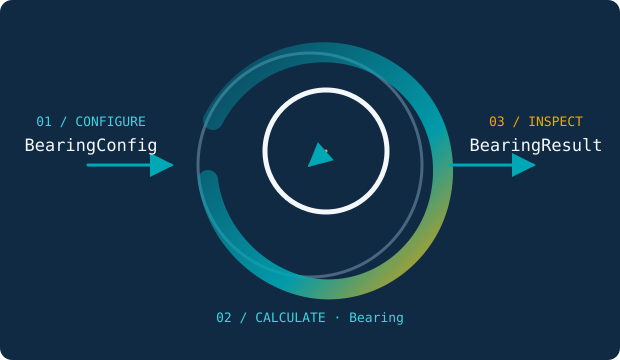

# ALB：从配置到可解释结果

<div class="alb-hero">
  <div>
    <div class="alb-hero__eyebrow">Active lubricated bearing · 0.4.5</div>
    <h1 class="alb-hero__title">轴承模型，按稳定接口运行。</h1>
    <p class="alb-hero__summary">
      ALB 将液膜、气膜、主动润滑、转子耦合和 ALBNN 代理模型组织为一致的
      配置、构建、计算与结果契约。先从任务进入，再查阅精确的类和字段。
    </p>
  </div>
  <div class="alb-lifecycle">
    
  </div>
</div>

<div class="alb-paths">
  <a class="alb-path-card" href="site/getting-started/first-bearing/">
    <strong>计算一个轴承</strong>
    从可复制 JSON5 开始，构建 Bearing，并读取力、压力、膜厚和收敛信息。
  </a>
  <a class="alb-path-card" href="site/guides/simulation/">
    <strong>配置一次仿真</strong>
    把轴承挂载到转子节点，声明载荷与历史策略，运行 one-shot simulation。
  </a>
</div>

## 稳定入口

普通用户从根命名空间开始：

```python
import ALB

config = ALB.load_bearing_config("bearing.json5")
bearing = ALB.build_bearing(config)
result = bearing.calculate(displacement=(0.0, 0.0), time=0.0)
print(result.fx, result.fy)
```

- [安装与能力组件](site/getting-started/installation.md)：选择 core 或 optional extra。
- [配置字段参考](api/bearing_config_reference.md)：查询字段、单位、默认值和约束。
- [根公开 API](api/public_api_reference.md)：查询 27 个稳定符号的真实签名。
- [公开接口边界](site/concepts/public-api-policy.md)：了解普通入口、高级 namespace 和内部实现的区别。

!!! info "文档范围"
    本站只发布稳定用户内容，不包含实时任务状态、远程工作站信息、daily maintenance、审计证据或单次实验记录。
